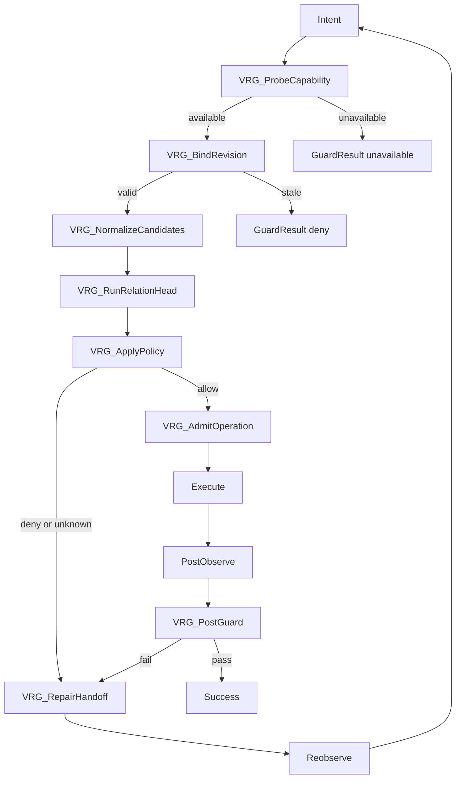

# Visual Relation Guard Adapter Spec

Status: proposed, disabled by default.

This document defines how a relation-only visual model can be added to
MacJev and WebAuto v4 later. It does not enable the model, change the public
Jev contract, or add an implementation.

## 1. Model Identity

The model discussed in the source note is:

- Name: RelateAnything
- Reference checkpoint: `maelic/relsgg-vits16plus`
- Parameters: 53.2 M
- Backbone: DINOv3 ViT-S/16+
- Code license: Apache-2.0
- Inputs: one image plus a set of regions
- Outputs: scored relations between ordered pairs of regions

RelateAnything is not a general vision-language model, object detector,
selector generator, or coordinate regressor. It requires an external source
of boxes or masks.

## 2. Verified Boundary

Official evidence:

- The paper reports 20 ms per frame on an A40, batch 1, bf16, with the
  relation head measured separately.
- The released ONNX bundle contains `relateanything.onnx`,
  `predicate_bank.npz`, `calibration.json`, and `thresholds.json`.
- The ONNX graph exposes `image`, `boxes`, `box_counts`, `W`, and `alpha`.
- The graph returns `pred_logits`, `pair_logits`, `sub_idx`, `obj_idx`, and
  `valid_mask`.

Local probe on Apple M3 Ultra:

- ONNX Runtime 1.30 CPU session loaded the official 198 MB ONNX file.
- A synthetic 448x448 image, 8 valid boxes, and 243 predicates completed
  with p50 latency of about 89.7 ms.
- The published ONNX graph is exported for 32 box slots. Callers must
  zero-pad to that contract and set `box_counts`.
- The ONNX Runtime CoreML provider loaded a session but failed during
  inference. CPU remains the only locally verified execution path.

The local probe validates the runtime contract only. It does not validate
UI accuracy, relation accuracy, or production suitability.

## 3. Intended Role

The adapter is a `visual_relation_guard`.

It answers bounded questions about known candidates, for example:

- Is the selected box inside the modal?
- Is the icon left of the input field?
- Is the text label adjacent to the expected control?
- Do two DOM or AX candidates have the claimed visual relation?

It must not:

- generate selectors;
- create candidate boxes;
- return arbitrary click coordinates;
- replace the primary DOM, AX, UIA, or Camo prior;
- replace text choice or action selection;
- become a public model alias for DiffusionGemma;
- return `allow` from a raw score without a versioned guard policy.

## 4. Adapter Contract

The adapter is internal to the application runtime. It is not a new public
Jev model alias.

### Request

```text
VisualRelationRequest
  request_id
  page_revision
  viewport_revision
  screenshot_digest
  image_ref
  boxes[]:
    box_id
    bbox: [x1, y1, x2, y2]
    source: dom | ax | uia | camo | detector | manual
    source_revision
    label?                 # diagnostic only
  assertions[]:
    assertion_id
    subject_box_id
    object_box_id
    predicate
    required
  policy_id
```

`label` is never passed to the model as a class label. It exists only for
diagnostics and evidence.

### Response

```text
VisualRelationResult
  guard: GuardResult
  diagnostics:
    model_id
    backend_id
    artifact_digest
    image_digest
    page_revision
    viewport_revision
    assertion_scores[]
    calibration_id
    policy_id
    latency_ms
```

`GuardResult.verdict` is the only admission result:

```text
allow
deny
unknown
risk_control
unavailable
```

Raw scores, probabilities, model names, and latency remain diagnostics.

## 5. Verdict Policy

The adapter must apply a versioned policy before returning a verdict.

| Condition | Verdict |
| --- | --- |
| All required assertions pass with a calibrated policy | `allow` |
| A required assertion is clearly false | `deny` |
| A required assertion is in the policy's ambiguity band | `unknown` |
| Revision, bbox, or candidate identity is stale | `deny` |
| The predicate is unavailable in the deployed bank | `unavailable` |
| The model, provider, or artifact is unavailable | `unavailable` |
| The page is in a login, captcha, or risk-control state | `risk_control` |

There is no silent fallback from CoreML to CPU. A fallback is allowed only
when the active deployment policy names it and records the fallback in
diagnostics.

## 6. DAG Node Definitions

The top-level workflow remains acyclic. The repair loop is a bounded
state machine inside `VisualRelationGuardMacro`.

| Node ID | Type | Input | Output | Failure edge |
| --- | --- | --- | --- | --- |
| `VRG_ProbeCapability` | capability probe | model path, provider policy | capability record | `unavailable` |
| `VRG_BindRevision` | evidence binding | page revision, viewport revision, screenshot digest | bound request | `deny` |
| `VRG_NormalizeCandidates` | application prior | DOM, AX, UIA, Camo, or detector boxes | bounded box catalog | `unknown` |
| `VRG_RunRelationHead` | model call | image, boxes, predicates, policy | pair scores | `unavailable` |
| `VRG_ApplyPolicy` | guard policy | pair scores, calibration, required assertions | `GuardResult` | `unknown` or `deny` |
| `VRG_RepairHandoff` | repair | `deny` or `unknown` result | repair request | stop |
| `VRG_AdmitOperation` | admission | `allow` result | operation admission | stop |
| `VRG_PostGuard` | postcondition guard | post-observation and evidence | success or repair | `VRG_RepairHandoff` |

### Graph



`VRG_RepairHandoff -> Reobserve -> Intent` is a bounded repair cycle. It
must not be represented as an unbounded top-level DAG edge.

## 7. Cache and Invalidation

A cached result is valid only when all of these are unchanged:

- model ID and artifact digest;
- backend ID and provider;
- policy ID and calibration ID;
- page revision and viewport revision;
- screenshot digest;
- box IDs, bboxes, and source revisions;
- predicate list.

Any change invalidates the result. A stale result is never promoted to
`allow`.

## 8. Required Tests Before Enablement

The adapter is not ready for use until these tests pass on real application
inputs:

1. Capability probe loads the artifact and reports provider availability.
2. A known true relation produces `allow` under a versioned policy.
3. A known false relation produces `deny`.
4. An ambiguous relation produces `unknown`.
5. A stale revision produces `deny`.
6. A missing artifact or failed provider produces `unavailable`.
7. More than 32 boxes is rejected or reduced by the application before the
   model call.
8. A predicate outside the deployed bank produces `unavailable` unless a
   text encoder is explicitly available.
9. CPU and any future accelerator path produce the same policy verdict on
   the same fixture.
10. No score, probability, or latency value can bypass the policy.

## 9. Activation Decision

The adapter remains disabled until a real UI evaluation shows that it adds
guard value over DOM, AX, UIA, and Camo priors alone.

Selector repair, promotion from assisted to automatic, and selector
correction remain application-owned policies. RelateAnything may provide
guard evidence to those policies, but it does not own them.
